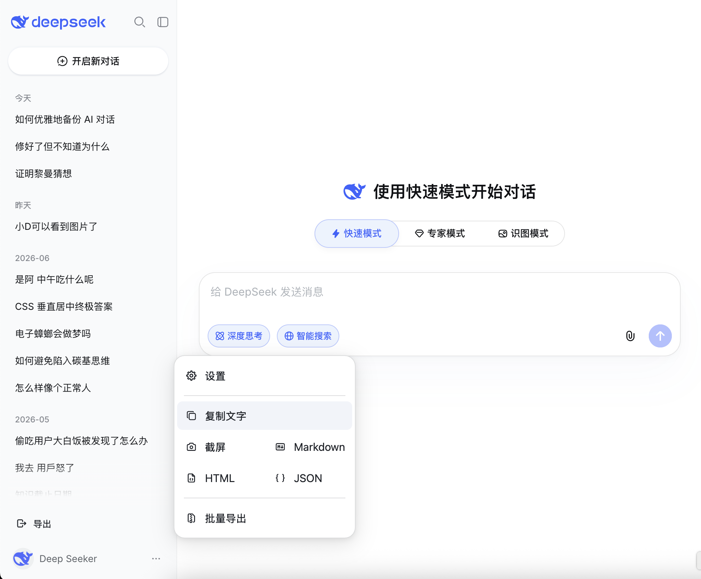

<h1 align="center">DeepSeek Exporter</h1>

一键导出你的 <a href="https://chat.deepseek.com/">DeepSeek</a> 对话。

[![license][license-image]][license-url]
[![release][release-image]][release-url]
[![GreasyFork][greasyfork-image]][greasyfork-url]

[license-image]: https://img.shields.io/github/license/pionxzh/deepseek-exporter?color=red
[license-url]: https://github.com/pionxzh/deepseek-exporter/blob/main/LICENSE
[release-image]: https://img.shields.io/github/v/release/pionxzh/deepseek-exporter?color=blue
[release-url]: https://github.com/pionxzh/deepseek-exporter/releases/latest
[greasyfork-image]: https://img.shields.io/static/v1?label=%20&message=GreasyFork&style=flat-square&labelColor=7B0000&color=960000&logo=data:image/png;base64,iVBORw0KGgoAAAANSUhEUgAAABAAAAAQCAYAAAAf8/9hAAAABmJLR0QA/wD/AP+gvaeTAAAACXBIWXMAAAsTAAALEwEAmpwYAAAAB3RJTUUH3ggEBCQHM3fXsAAAAVdJREFUOMudkz2qwkAUhc/goBaGJBgUtBCZyj0ILkpwAW7Bws4yO3AHLiCtEFD8KVREkoiFxZzX5A2KGfN4F04zMN+ce+5c4LMUgDmANYBnrnV+plBSi+FwyHq9TgA2LQpvCiEiABwMBtzv95RSfoNEHy8DYBzHrNVqVEr9BWKcqNFoxF6vx3a7zc1mYyC73a4MogBg7vs+z+czO50OW60Wt9stK5UKp9Mpj8cjq9WqDTBHnjAdxzGQZrPJw+HA31oulzbAWgLoA0CWZVBKIY5jzGYzdLtdE9DlcrFNrY98zobqOA6TJKHW2jg4nU5sNBpFDp6mhVe5rsvVasUwDHm9Xqm15u12o+/7Hy0gD8KatOd5vN/v1FozTVN6nkchxFuI6hsAAIMg4OPxMJCXdtTbR7JJCMEgCJhlGUlyPB4XfumozInrupxMJpRSRtZlKoNYl+m/6/wDuWAjtPfsQuwAAAAASUVORK5CYII=
[greasyfork-url]: https://greasyfork.org/scripts/591297-deepseek-exporter

[English](./README.md) &nbsp;&nbsp;|&nbsp;&nbsp; 简体中文 &nbsp;&nbsp;|&nbsp;&nbsp; [繁體中文](./README_zh-Hant.md)

## ✨ 功能特色

- 📝 **多种导出格式** — Markdown、HTML、PNG 截图、纯文本、原始 JSON
- 🧠 **包含深度思考** — 可选导出推理过程，而不只是最终回答
- 🔍 **保留搜索来源** — DeepSeek 联网搜索的引用来源会一并保留
- 📦 **批量导出** — 勾选多个（或全部）对话一次性下载，还可打包为单个 ZIP
- 🖼️ **保留图片** — 附件会嵌入到 Markdown 和 HTML 导出中
- 🎭 **角色扮演友好** — 支持导出 TavernAI / SillyTavern JSONL 和 text-generation-webui JSON

## 📦 安装

**1.** 安装用户脚本管理器 — [Tampermonkey][link-tampermonkey]（或 [Violentmonkey][link-violentmonkey]）：

[][link-chrome] &nbsp;&nbsp; [][link-firefox] &nbsp;&nbsp; [][link-edge]

[link-tampermonkey]: https://www.tampermonkey.net/
[link-violentmonkey]: https://violentmonkey.github.io/
[link-chrome]: https://chrome.google.com/webstore/detail/tampermonkey/dhdgffkkebhmkfjojejmpbldmpobfkfo 'Chrome Web Store'
[link-firefox]: https://addons.mozilla.org/firefox/addon/tampermonkey 'Firefox Add-ons'
[link-edge]: https://microsoftedge.microsoft.com/addons/detail/tampermonkey/iikmkjmpaadaobahmlepeloendndfphd 'Edge Add-ons'

**2.** 从 GreasyFork 或 GitHub 安装脚本，然后打开 [chat.deepseek.com](https://chat.deepseek.com/)，导出菜单就会出现在页面上。

| GreasyFork | GitHub |
| :---: | :---: |
| [![安装][install-image]](https://greasyfork.org/scripts/591297-deepseek-exporter) | [![安装][install-image]](https://raw.githubusercontent.com/pionxzh/deepseek-exporter/main/dist/deepseek.user.js) |

[install-image]: https://img.shields.io/badge/-%E5%AE%89%E8%A3%85-blue

> [!TIP]
> Chrome 用户请确认已为 Tampermonkey 启用 [`允许用户脚本`](https://www.tampermonkey.net/faq.php?q=Q209)。

## 🔒 隐私

一切都在你的浏览器本地运行。脚本只会使用你已登录的会话与 `chat.deepseek.com` 通信——你的对话不会被上传到任何其他地方。

## 💬 也在用 ChatGPT？

看看 [**ChatGPT Exporter**](https://github.com/pionxzh/chatgpt-exporter) —— 为 ChatGPT 提供同样功能的姊妹项目。

## 🤝 参与贡献

欢迎贡献 — 请参阅 [CONTRIBUTING.md](./CONTRIBUTING.md) 开始上手。

## 📄 许可证

[MIT](./LICENSE)
